# DOSSIER DE CONCEPTION - SYSTÈME DE GESTION DES MISSIONS
## GardensNoLife

**Version :** 4.0  
**Date :** Décembre 2024  
**Entreprise :** GardensNoLife - Conception et réalisation de jardins à la carte  
**Localisation :** Toulouse, Occitanie (clientèle mondiale)

---

## TABLE DES MATIÈRES

1. [Vue Fonctionnelle du Système](#1-vue-fonctionnelle-du-système)
2. [Justification des Choix de Modélisation des Processus Métiers](#2-justification-des-choix-de-modélisation-des-processus-métiers)
3. [Justification des Choix de Modélisation des Données Métiers](#3-justification-des-choix-de-modélisation-des-données-métiers)
4. [Architecture Logicielle](#4-architecture-logicielle)
5. [Interactions Système](#5-interactions-système)
6. [Éléments de Contexte et Gestion des Erreurs](#6-éléments-de-contexte-et-gestion-des-erreurs)

---

## 1. VUE FONCTIONNELLE DU SYSTÈME

### 1.1 Contexte Métier

GardensNoLife est une entreprise toulousaine spécialisée dans la conception et réalisation de jardins à la carte avec une clientèle mondiale. Le système actuel de gestion des missions (tableur, emails, papier) nécessite une automatisation complète.

**Problématique :** Le processus actuel de gestion des demandes de mission est entièrement manuel (tableur, emails, papiers), ce qui génère des erreurs et une perte de temps considérable.

**Objectif :** Automatiser et rationaliser le processus de demande et validation des missions avec intégration au système RH.

### 1.2 Diagramme de Cas d'Utilisation Global

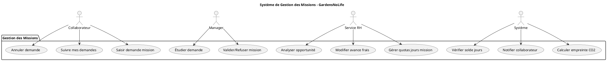

### 1.3 Acteurs du Système

| Acteur | Rôle | Responsabilités |
|--------|------|----------------|
| **Collaborateur** | Demandeur de mission | Saisie des demandes, suivi, validation finale des conditions modifiées |
| **Manager** | Validateur hiérarchique | Validation/refus des demandes, décision finale en cas de désaccord avec RH |
| **Service RH** | Gestionnaire administratif | Analyse d'opportunité, gestion des quotas, validation des demandes exceptionnelles |
| **Système** | Automatisation | Vérifications automatiques, calculs, notifications |

---

## 2. JUSTIFICATION DES CHOIX DE MODÉLISATION DES PROCESSUS MÉTIERS

### 2.1 Évolution des Processus par Version

#### Version 1 - Processus de Base
Modélisation simple avec gateway de synchronisation pour gérer les désaccords Manager/RH.

#### Version 4 - Processus Complet avec Empreinte Carbone

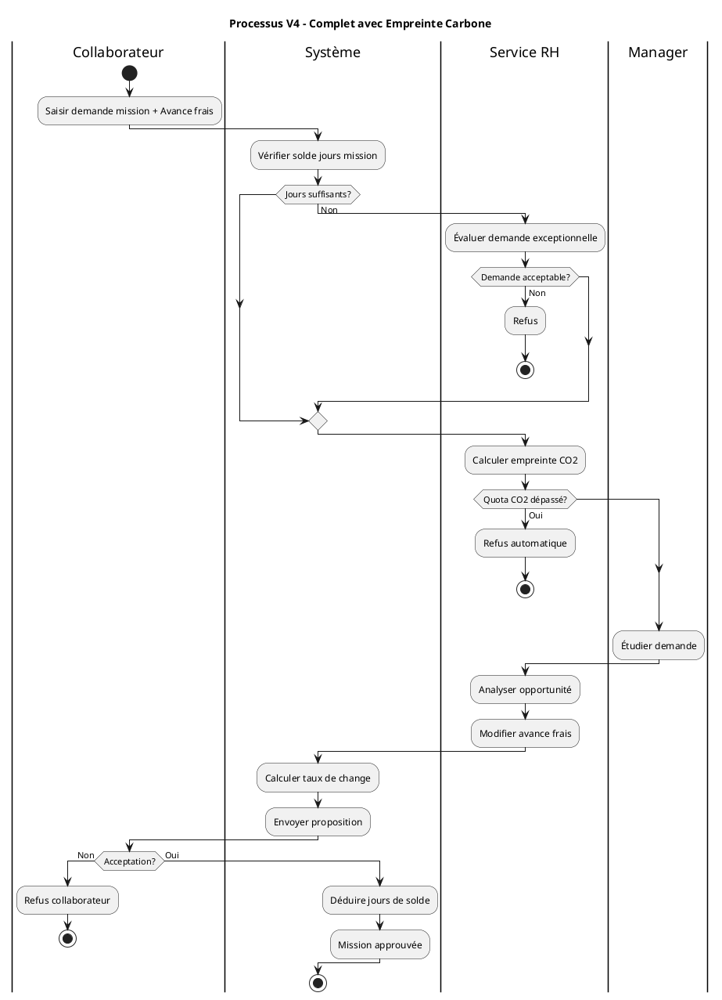

### 2.2 Patterns BPMN Utilisés

1. **Exclusive Gateway (XOR)** : Décisions mutuellement exclusives
2. **Parallel Gateway (AND)** : Exécution parallèle des validations
3. **Inclusive Gateway** : Gestion des cas exceptionnels
4. **Service Tasks** : Intégrations système automatiques
5. **User Tasks** : Interventions humaines avec formulaires

---

## 3. JUSTIFICATION DES CHOIX DE MODÉLISATION DES DONNÉES MÉTIERS

### 3.1 Modèle de Données Conceptuel

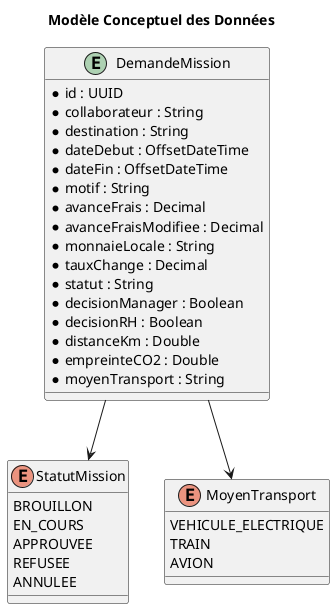

### 3.2 Justifications des Choix de Données

#### 3.2.1 Entité DemandeMission
**Choix :** Entité centrale avec tous les attributs de gestion
**Justifications :**
- **avanceFrais + avanceFraisModifiee** : Traçabilité des modifications RH
- **monnaieLocale + tauxChange** : Support international complet
- **empreinteCO2 + moyenTransport** : Calculs environnementaux
- **statut énuméré** : États contrôlés (BROUILLON, EN_COURS, APPROUVEE, REFUSEE, ANNULEE)

#### 3.2.2 Gestion des Quotas
**Choix :** Attributs directs sur Collaborateur
**Justifications :**
- Performance : accès direct sans jointures
- Cohérence : mise à jour atomique
- Simplicité : pas de gestion de périodes complexes

#### 3.2.3 Historique et Traçabilité
**Choix :** Table d'audit séparée
**Justifications :**
- Conformité réglementaire
- Debugging et support utilisateur
- Analytics et reporting

### 3.3 Modèle de Données Physique

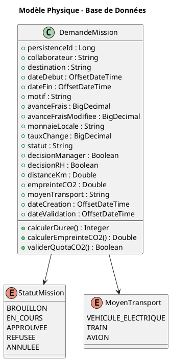

---

## 4. ARCHITECTURE LOGICIELLE

### 4.1 Diagramme de Composants

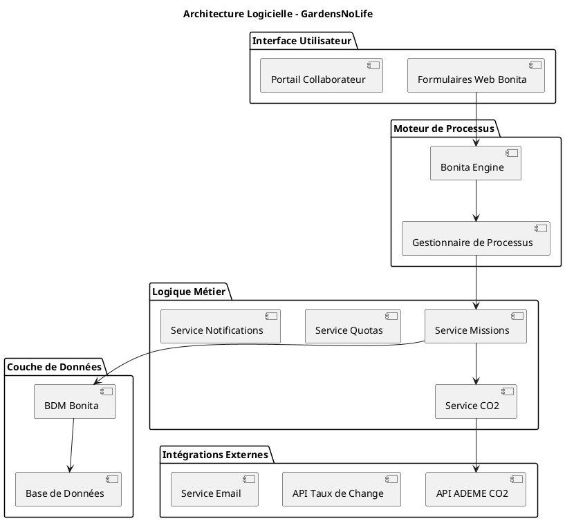

### 4.2 Diagramme de Déploiement

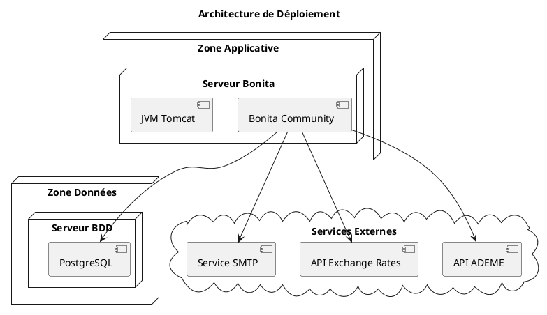

### 4.3 Justifications Architecturales

#### 4.3.1 Choix de Bonita Community
**Justifications :**
- Conformité au cahier des charges
- Intégration native des processus BPMN
- Gestion intégrée des formulaires et notifications
- Coût maîtrisé pour l'entreprise

#### 4.3.2 Architecture Multi-Tiers
**Justifications :**
- Séparation des responsabilités
- Scalabilité horizontale possible
- Maintenance facilitée
- Sécurité par cloisonnement

#### 4.3.3 Intégrations API Externes
**Justifications :**
- **API ADEME** : Données officielles et fiables pour CO2
- **API Taux de Change** : Données temps réel pour conversions
- **Service SMTP** : Notifications robustes

---

## 5. INTERACTIONS SYSTÈME

### 5.1 Diagramme de Séquence - Saisie Demande Mission

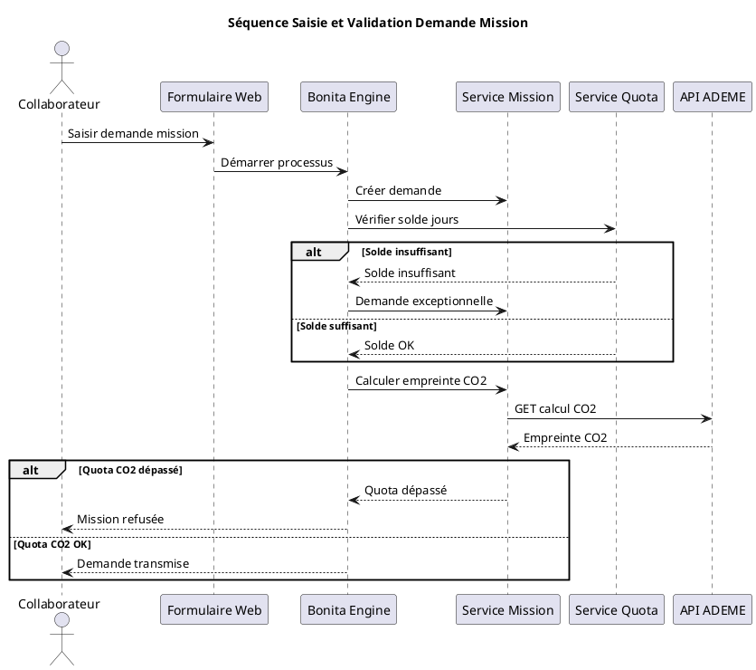

### 5.2 Diagramme de Séquence - Validation Manager et RH

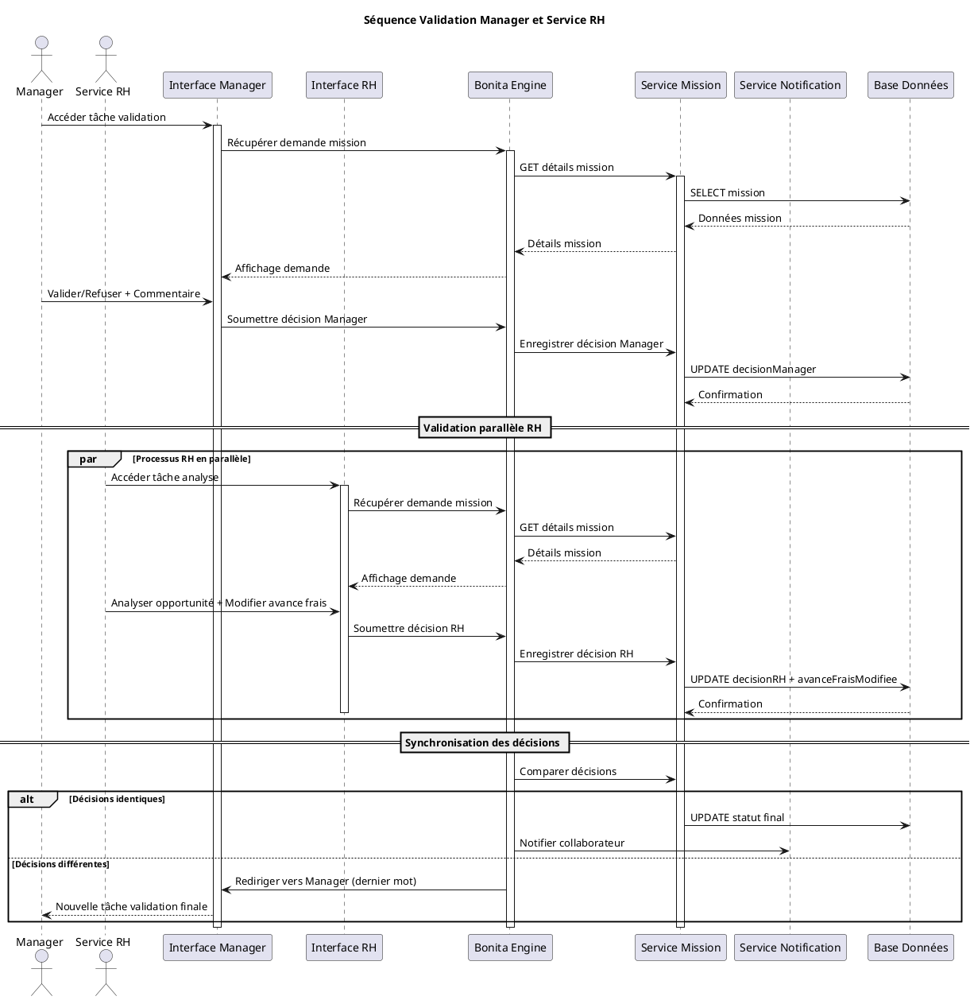

### 5.3 Diagramme de Séquence - Gestion Avance Frais et Conversion

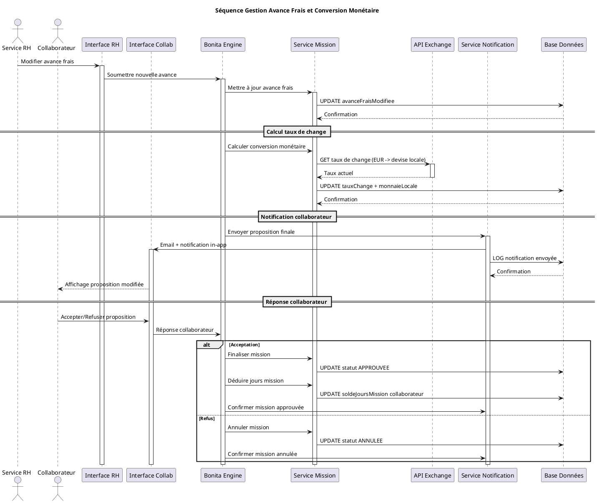

---

## 6. ÉLÉMENTS DE CONTEXTE ET GESTION DES ERREURS

### 6.1 Contraintes et Règles Métier

#### 6.1.1 Contraintes Administratives
- **Quota jours mission :** 25 jours maximum par collaborateur par an
- **Quota CO2 :** 1 tonne équivalent CO2 par collaborateur par an
- **Demandes exceptionnelles :** Validation RH obligatoire si quotas dépassés

#### 6.1.2 Règles de Transport et Calcul CO2
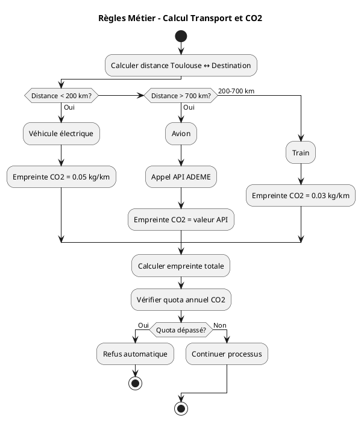

#### 6.1.3 Règles de Validation
- **Manager :** Décision finale en cas de désaccord avec RH
- **RH :** Peut modifier l'avance de frais librement
- **Collaborateur :** Peut refuser la mission après modification RH

### 6.2 Gestion des Erreurs et Cas d'Exception

#### 6.2.1 Matrice de Gestion des Erreurs

| Type d'Erreur | Cause | Action | Responsable |
|---------------|-------|---------|-------------|
| **Quota jours dépassé** | Demande > solde disponible | Redirection vers processus exceptionnel | Système → RH |
| **Quota CO2 dépassé** | Empreinte calculée > quota restant | Refus automatique + notification | Système |
| **API ADEME indisponible** | Timeout/erreur réseau | Utilisation valeurs par défaut + log | Système |
| **API Taux change indisponible** | Timeout/erreur réseau | Utilisation taux BCE + alerte admin | Système |
| **Email notification échec** | SMTP indisponible | Retry 3x + notification alternative | Système |
| **Désaccord Manager/RH** | Décisions opposées | Processus de réétude Manager | Métier |

#### 6.2.2 Diagramme de Gestion des Erreurs API

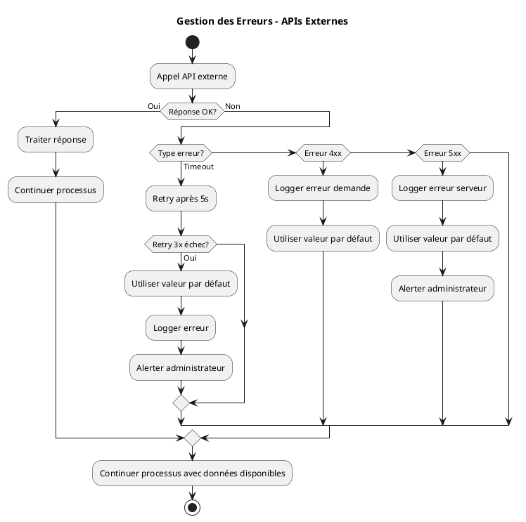

### 6.3 Éléments de Sécurité

#### 6.3.1 Authentification et Autorisation
- **SSO :** Integration avec Active Directory GardensNoLife
- **RBAC :** Rôles définis (Collaborateur, Manager, RH, Admin)
- **API Security :** Tokens JWT pour APIs externes

#### 6.3.2 Protection des Données
- **RGPD :** Anonymisation possible des données après archivage
- **Chiffrement :** Communications HTTPS/TLS 1.3
- **Audit :** Traçabilité complète des actions utilisateurs

### 6.4 Performance et Scalabilité

#### 6.4.1 Indicateurs de Performance
- **Temps de traitement :** < 5 secondes par demande
- **Disponibilité :** 99.5% (hors maintenance programmée)
- **Capacité :** 100 demandes simultanées

#### 6.4.2 Stratégies d'Optimisation
- **Cache Redis :** Taux de change, quotas utilisateurs
- **Pool de connexions :** Base de données optimisée
- **Pagination :** Listes de demandes par lots de 20

### 6.5 Monitoring et Supervision

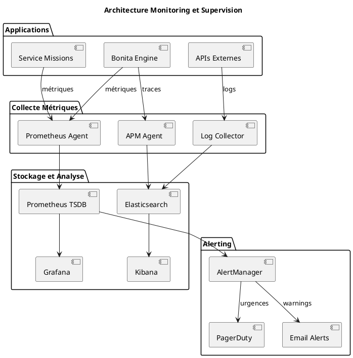

### 6.6 Plan de Continuité et Sauvegarde

#### 6.6.1 Stratégie de Sauvegarde
- **Base de données :** Sauvegarde complète quotidienne + log transaction
- **Fichiers processus :** Versioning Git + backup sur NAS
- **Configuration :** Infrastructure as Code (Ansible)

#### 6.6.2 Plan de Reprise d'Activité
- **RTO :** 4 heures maximum
- **RPO :** 1 heure maximum (perte de données acceptable)
- **Site de secours :** Datacenter partenaire avec réplication async

---

## CONCLUSION

Ce dossier de conception présente une solution complète et évolutive pour la gestion des missions chez GardensNoLife. L'architecture proposée répond aux exigences fonctionnelles tout en intégrant les contraintes modernes de sécurité, performance et monitoring.

**Points forts de la solution :**
- ✅ Automatisation complète du processus manuel existant
- ✅ Intégration des contraintes administratives et environnementales
- ✅ Architecture scalable et maintenable
- ✅ Gestion robuste des erreurs et cas d'exception
- ✅ Conformité RGPD et sécurité moderne

**Prochaines étapes :**
1. Validation de l'architecture avec les équipes techniques
2. Développement des maquettes Bonita
3. Tests d'intégration avec les APIs externes
4. Formation des utilisateurs et mise en production progressive 